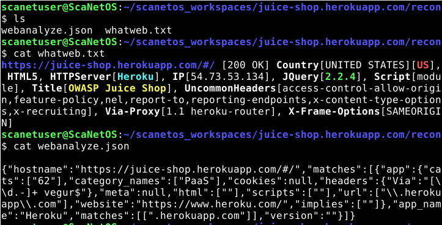
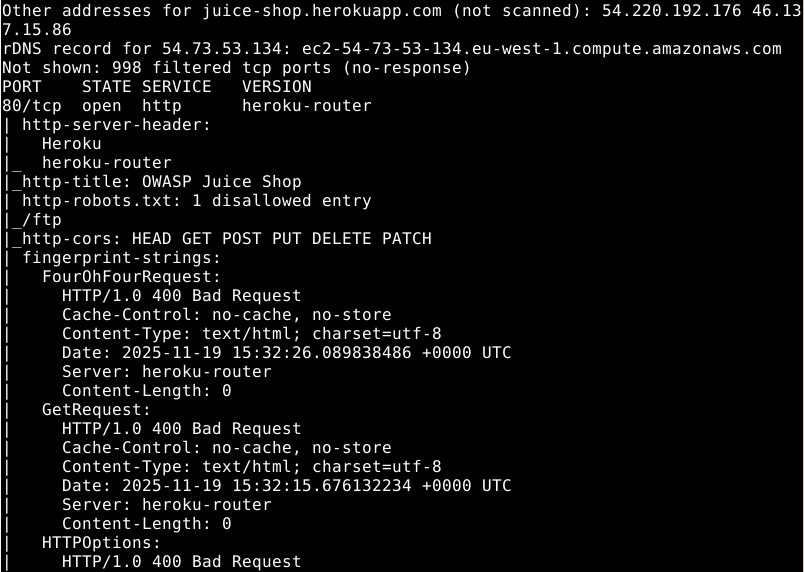
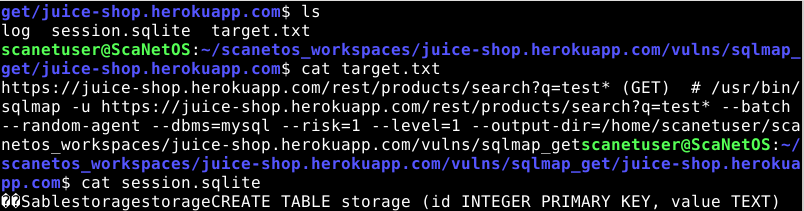

# Módulo: Reconocimiento Web (Fingerprinting)

## [1] Webanalyze/WhatWeb (Fingerprint) <--- ¡CONSOLIDADO!

El objetivo de este módulo es realizar la "huella digital" (Fingerprinting) de la aplicación web, una fase crucial para entender la superficie de ataque antes de cualquier prueba activa.

### 🎯 Objetivo
Identificar las tecnologías que usa el servidor, desde el backend (Lenguajes de programación, CMS, Servidores Web) hasta el frontend (Librerías JavaScript, Frameworks).

### 🛠️ Herramientas Utilizadas
Este módulo ejecuta de forma consolidada las siguientes herramientas, enfocadas en la recopilación de datos pasiva y semi-activa:

Webanalyze: Enfocado en la detección de frameworks de JavaScript, librerías y tecnologías del lado del cliente.

WhatWeb: Especializado en la detección amplia de tecnologías, incluyendo servidores web (Apache, Nginx), sistemas operativos, versiones de PHP/Python y módulos específicos.

### Paso a Paso para el Módulo [1]:

Requisito: Debe haber definido el objetivo previamente con la opción [0].

Selección: Elige la opción [1] Reconocimiento web (Passive/Active) en el menú principal.

Ejecución: El panel comenzará a ejecutar Webanalyze seguido de WhatWeb en el TARGET_URL definido.

Visualización: El script mostrará un resumen conciso de las tecnologías más importantes encontradas (ej: "WordPress v6.4, Nginx/1.18, jQuery").

Guardado de Resultados: Todos los logs completos de Webanalyze (.json) y WhatWeb (.txt) se guardan automáticamente en la carpeta de resultados del objetivo para su análisis detallado posterior. La ruta completa de los resultados de reconocimiento es: ~/scanetos_workspaces/url del sitio/recon

  

### 💡 Valor para el Auditor

La información de Fingerprinting es vital porque:

Define Prioridades: Si el sitio usa WordPress v5.0, el auditor sabe que debe enfocarse inmediatamente en buscar vulnerabilidades específicas de esa versión.

Reduce el Ruido: Si se detecta un Web Application Firewall (WAF), el auditor sabrá que las pruebas de inyección deben ser más sutiles o que deben usar técnicas de evasión.

## [2] Nmap (Fast Scan)

Este módulo se enfoca en el escaneo de red fundamental para determinar la conectividad, los puertos abiertos y los servicios básicos del objetivo, utilizando la herramienta estándar de la industria, Nmap.

🎯 Objetivo
Identificar la topología de red, los puertos TCP y UDP accesibles, y las versiones de los servicios que se ejecutan en esos puertos. Esto es crucial para saber dónde enfocar los ataques de la siguiente fase.

🛠️ Herramienta Utilizada
Nmap (Network Mapper): Ejecutado en modo de escaneo rápido (-F o --top-ports), enfocándose solo en los puertos más comunes (HTTP, HTTPS, SSH, FTP, etc.) para reducir el tiempo de ejecución.

Flujo Paso a Paso del Módulo [2]:

Selección: Elige la opción [2] Nmap (Fast Scan) en el menú principal.

Ejecución: El script ejecutará Nmap contra la IP o el dominio del objetivo que definiste en el Paso [0].

Visualización en Vivo: El panel mostrará la salida de Nmap directamente en la terminal, indicando los puertos que están open (abiertos) y la versión del servicio detectado (ej: 80/tcp open http Apache httpd 2.4.41).

Guardado de Resultados: Se genera un log de Nmap en formato nmap o xml para el análisis y reporte final.

Ruta de Resultados: La salida detallada para este módulo se guarda en: ~/scanetos_workspaces/url del sitio/recon con el nombre de nmap_full.txt
💡 Valor para el Auditor
Un escaneo rápido de puertos es el mapa del sitio web. Permite:

Descubrir Servicios Inesperados: Identificar un puerto 3306 (MySQL) o 21 (FTP) abierto en un servidor web, lo cual indica un posible fallo de configuración grave.

Ahorrar Tiempo: Al ser un escaneo rápido, proporciona la información necesaria para el siguiente paso sin ejecutar un barrido de 65.535 puertos, lo que puede tardar horas.

  

## [3] Fuzzing de Directorios (ffuf/GoBuster)

Este módulo es esencial en la fase de enumeración de contenido y busca descubrir archivos y directorios ocultos, de backup, o no enlazados que puedan revelar secretos, credenciales o endpoints sensibles.

🎯 Objetivo

El objetivo es realizar una búsqueda de fuerza bruta inteligente para mapear la superficie completa del sitio web, incluyendo las rutas que los desarrolladores no quieren que el público encuentre.

🛠️ Herramientas Utilizadas:

Este módulo utiliza herramientas de fuzzing de alto rendimiento para el descubrimiento de contenido:

ffuf / GoBuster: Herramientas altamente optimizadas para enviar miles de peticiones HTTP por segundo y filtrar las respuestas útiles.

Flujo Paso a Paso del Módulo [3]:

Selección: Elige la opción [3] Fuzzing de Directorios en el menú principal.

Selección de Wordlist: El panel te preguntará qué lista de palabras (wordlist) deseas utilizar. Las listas de SecLists están integradas y son las recomendadas (ej: directory-list-2.3-medium.txt).

Ejecución Optimizada: El script ejecutará el fuzzing utilizando una configuración optimizada:

Inclusión: Solo se mostrarán los códigos de estado más relevantes (200, 302, 204, 307).

Filtrado: Se excluyen los códigos de error comunes que no aportan valor (404 Not Found).

Guardado de Resultados: Se genera un informe simple de texto (.txt) con la lista de rutas encontradas, organizado por código de estado.

Ruta de Resultados: La salida detallada para este módulo se guarda en: ~/scanetos_workspaces/url del sitio/fuzzing

💡 Valor para el Auditor:

El Fuzzing es la única forma de encontrar fallos de seguridad basados en la divulgación de información por caminos no enlazados. Un solo resultado de este módulo puede ser un hallazgo crítico:

Archivos de Configuración: Rutas como /.env o /config.php.bak.

Paneles de Administración: Rutas como /panel o /admin-login.

Archivos de Backup: Rutas como /sitio_viejo.zip o /wp-content.tgz.

Nota sobre Resultados Vacíos: Si el Fuzzing de Directorios no devuelve resultados (solo códigos 404 o 403), esto es un indicador de una configuración de seguridad robusta. El servidor probablemente utiliza un WAF (Web Application Firewall) y/o ha configurado correctamente su acceso a archivos, bloqueando la enumeración. En este caso, el auditor debe pasar a técnicas más avanzadas o a módulos de ataque enfocados en la API (Módulo [4] - SQLMap).

## Módulo [4] Escaneo de Vulnerabilidades (SQLMap)

Este módulo se dedica a la prueba activa y automatizada de Inyección SQL (SQLi) y otras vulnerabilidades de inyección en parámetros de URL, endpoints de API y formularios.

🎯 Objetivo:

El objetivo principal es identificar y validar endpoints que permitan a un atacante manipular las consultas a la base de datos del servidor, lo que puede llevar a la fuga de información sensible, credenciales o la manipulación de datos.

🛠️ Herramienta Utilizada:

SQLMap: La herramienta de código abierto estándar de la industria para detectar y explotar vulnerabilidades de inyección SQL.

Flujo Paso a Paso del Módulo [4]:

Selección: Elige la opción [4] Escaneo de Vulnerabilidades (SQLMap) en el menú principal.

Identificación de Endpoints: El panel utiliza los resultados de los módulos anteriores (Módulos [1] y [3]) para localizar automáticamente endpoints con parámetros probables (ej: ).

Ejecución de SQLMap: El script ejecuta SQLMap contra los endpoints identificados con configuraciones optimizadas (--batch, --level=3, --risk=2) para realizar una prueba exhaustiva y eficiente.

Confirmación de Vulnerabilidad: Si SQLMap identifica una inyección SQL válida, el panel mostrará inmediatamente una ALERTA CRÍTICA y ofrecerá opciones para profundizar la explotación (ej: obtener bases de datos o tablas).

Guardado de Resultados: Todos los logs de SQLMap, incluyendo los payloads exitosos y los backups de sesiones, se guardan para la revisión del auditor.

Ruta de Resultados: La salida detallada para este módulo se guarda en: /scanetos_workspaces/url del sitio/vulns/sqlmap_get/url del sitio

  

💡 Valor para el Auditor:

Una vulnerabilidad de SQLi es a menudo la vía más rápida para comprometer completamente una aplicación. Este módulo le ahorra al auditor el tiempo de prueba manual de miles de payloads y proporciona una confirmación inmediata de la vulnerabilidad. En el contexto de un sitio como WordPress (revelado en el Módulo [1]), este módulo es crucial para auditar plugins y la API REST.
