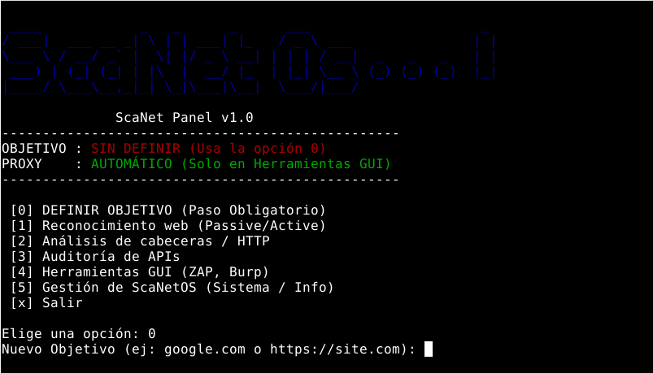
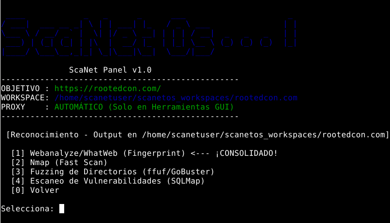
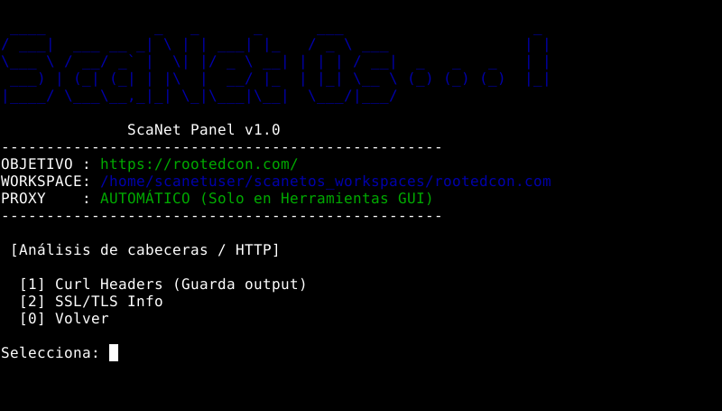
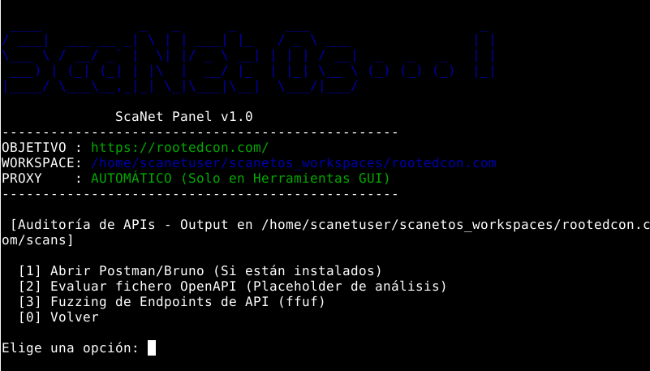
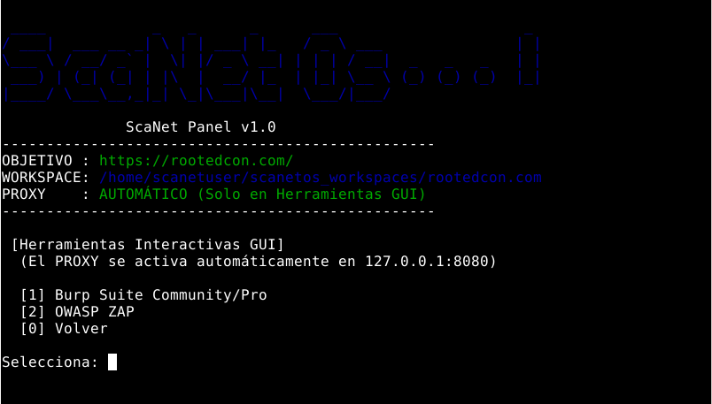
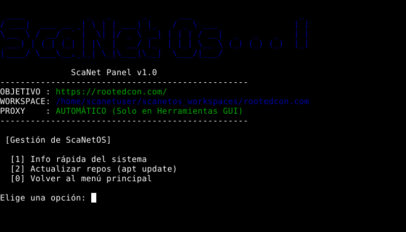

# 🚀 Guía de Primeros Pasos: Uso de ScaNetOS Panel

Este documento detalla la configuración inicial y el flujo de trabajo paso a paso para la auditoría web utilizando el ScaNet Panel (script Bash) en la Máquina Virtual ScaNetOS.

---

## I. 💻 Configuración Inicial (Login)

El ScaNet Panel está diseñado para iniciarse automáticamente, pero es importante conocer las credenciales y la estructura de trabajo.

### A. Login de la Máquina Virtual
Una vez importado el archivo `.OVA` en tu hipervisor (VirtualBox/VMware):

| Campo | Valor |
| :--- | :--- |
| **Usuario (Username)** | `scanetuser` |
| **Contraseña (Password)** | `scanetuser` |

### B. Estructura de Trabajo
Todos los resultados de las herramientas CLI (Nmap, ffuf, SQLMap, etc.) se guardan automáticamente en carpetas separadas por objetivo dentro del directorio del usuario.

---

## II. 🎯 Flujo de Trabajo del ScaNet Panel

El panel opera de forma secuencial. El paso más crucial es el [0] Definir Objetivo.

### Paso 1: Definir Objetivo (Opción `[0]`)

Este es el paso **obligatorio** antes de ejecutar cualquier análisis.

1.  En el menú principal, elige la opción **`[0] DEFINIR OBJETIVO`**.
2.  **Introduce la URL completa y válida** del sitio a auditar (ej: `https://rootedcon.com/`).
3.  El panel validará la URL y actualizará el estado del **OBJETIVO**.
4.  El sistema te devolverá al menú principal.

  

### Paso 2: Reconocimiento (Módulo `[1]`)

El Módulo `[1]` inicia la fase de recopilación de información sobre el objetivo.

1.  Elige la opción **`[1] Reconocimiento web (Passive/Active)`**.
2.  El panel ejecutará automáticamente herramientas de *fingerprinting* (**Webanalyze**) y escaneo de puertos (**Nmap**) contra el objetivo definido.
3.  **No se requiere interacción**; el panel esperará a que cada herramienta termine antes de continuar.
4.  Los resultados se guardan en el directorio de resultados del objetivo.

  

### Paso 3: Análisis de Vulnerabilidades (Módulos `[2]` y `[3]`)

Una vez que tengas la información de reconocimiento, pasa a las pruebas activas.

1.  **Análisis HTTP/Cabeceras (`[2]`):** Ejecuta scripts para analizar las cabeceras HTTP, métodos permitidos y configuraciones de servidor. Ideal para pruebas de seguridad básica de infraestructura.

  

3.  **Auditoría de APIs (`[3]`):** Lanza herramientas de **fuzzing** (**ffuf**) y pruebas de inyección (**SQLMap**) dirigidas a los endpoints.
    * Si el script detecta la necesidad de parámetros, se te pedirá que los ingreses.

  

### Paso 4: Herramientas Gráficas (Módulo `[4]`)

Este es el módulo clave para el análisis manual con intercepción de tráfico.

1.  Elige la opción **`[4] Herramientas GUI (ZAP, Burp)`**.
2.  **Selecciona la herramienta** (ej: Burp Suite).
3.  El panel no solo iniciará la aplicación, sino que también **configurará automáticamente el proxy del sistema operativo de la MV** para que el tráfico se intercepte sin necesidad de configuración manual por parte del usuario.

  

### Paso 5: Utilidades y Gestión (`[5]`)

Utiliza este módulo para tareas administrativas:

1.  **Gestión de Resultados:** Abre el explorador de archivos directamente en el directorio de trabajo del proyecto para revisar los logs de las herramientas.
2.  **Actualización:** Actualiza las *wordlists* o las dependencias de las herramientas CLI.
3.  **Salir:** Vuelve a la línea de comandos normal de Linux o cierra la sesión.

  

---
